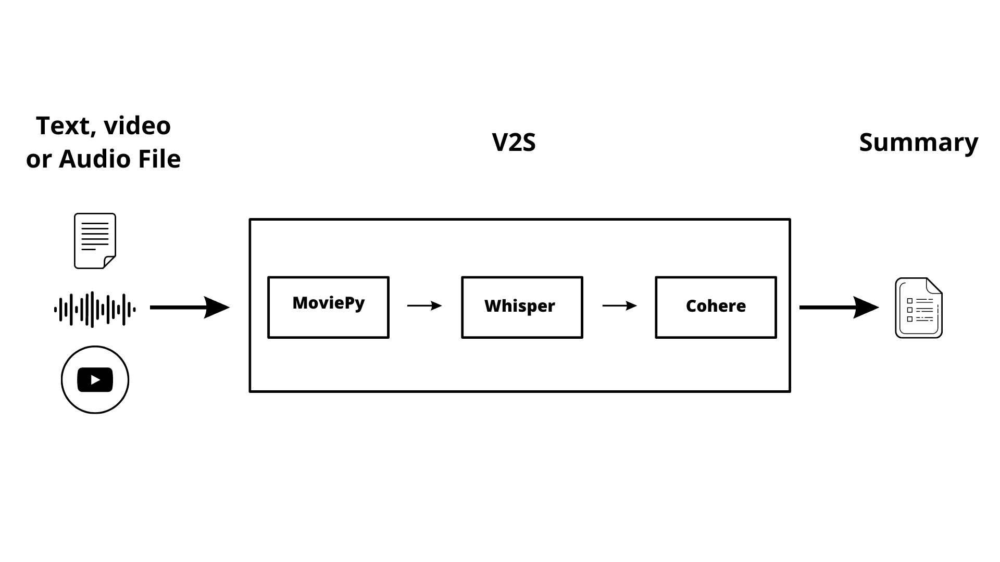

# V2S

V2S is a tool that converts txt, audio, and video files into a summarized text. It works by first converting the input (video) into audio, then transcribing it and finally summarizing the transcribed text using a text summarization AI model.

## How to use
Select an input file: Choose between a txt, audio, or video file.
Run the V2S tool: The selected file will be converted (if necessary), transcribed and summarized to produce the final output.

## Features
* Conversion: Converts video files into audio to make it ready for transcription. It uses [MoveiPy](https://github.com/Zulko/moviepy)
* Transcription: Transcribes the audio or text input into a text format using [Whisper](https://github.com/openai/whisper) by OpenAI.
* Summarization: Summarizes the transcribed text using a text summarization AI model to produce a concise summary of the input. It uses [Cohere](https://cohere.ai/)

## Requirements
The requiremenst for the project can be found in the `requirements.txt` file. To install the requirements, run the following command:
### `pip install -r requirements.txt`

## Conclusion
V2S is a useful tool for those who want to quickly summarize large amounts of text from audio or video sources. Try it out and see how it can simplify your work process!